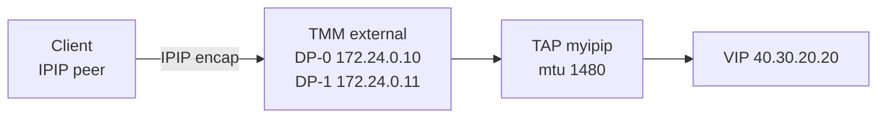

# 2609_f5bnk

F5 BNK Gateway API PoC. HTTP/gRPC/TCP/UDP 테스트는 VIP `40.30.20.20` 으로 들어가며, 클라이언트는 **TMM IPIP tunnel** 로 그 VIP에 도달합니다.

기능 테스트 YAML은 `HTTP_Routing/`, `Advanced_Feature/` 를 봅니다. 아래는 TMM 쪽에 tunnel을 만드는 설정입니다.

---

# TMM IPIP Tunnel

## 목적

TMM 데이터플레인에 IPIP tunnel `myipip` 를 만들어, 클라이언트 트래픽이 TMM `external` VLAN(`172.24.0.10/11`)을 통해 VIP로 들어가게 합니다.



이 클러스터 기준 값:

| 항목 | 값 |
|---|---|
| Namespace | `f5-bnk-instance` |
| ConfigMap | `tmm-init` |
| DaemonSet | `f5-tmm` |
| 마운트 경로 | `/opt/lib/tmm` (`tmm_init.tcl`, `user_conf.tcl`) |
| Tunnel 이름 | `myipip` |
| DP-0 (`f5-tmm-6h6gx` / worker02) | `local_ip 172.24.0.10` |
| DP-1 (`f5-tmm-z5gjs` / worker01) | `local_ip 172.24.0.11` |
| MTU | `1480` |
| TMM 이미지 (적용본) | `repo.f5.com/images/tmm-img:v10.203.3` |

`local_ip` 는 Linux TAP에 붙는 IPv4가 아니라 **IPIP 캡슐화 소스**입니다. `external` 인터페이스가 이미 그 주소를 갖고 있어야 합니다.

---

## 동작 원리

1. TMM은 기동 시 ConfigMap의 `tmm_init.tcl` 을 읽습니다.
2. `tmm_init.tcl` 의 `file_reload` 가 `/opt/lib/tmm/user_conf.tcl` 을 주기적으로 감시합니다. **파일 내용이 바뀔 때만** 다시 실행합니다.
3. `user_conf.tcl` 은 `[tmm_device_name]` 이 `DP-0` / `DP-1` 일 때만 `ipip_tunnel` 을 만듭니다.
4. 성공하면 TMM이 TAP `myipip` 를 열고, debug 컨테이너의 `ip -br a` 에 인터페이스가 보입니다.

device name은 TMM 기동 직후가 아니라, CNE controller가 `active_tmm_device_names` 를 내려준 뒤에야 채워집니다. 그 전에 `user_conf.tcl` 을 읽으면 switch가 아무 것도 타지 않아 tunnel이 안 생깁니다.

```text
TMM start
  → tmm_init.tcl 로드 (file_reload 등록)
  → user_conf.tcl 1차 로드    tmm_device_name = ""   ← tunnel 미생성
  → active_tmm_device_names   DP-0 / DP-1 할당
  → (파일 변경 없음이면 여기서 멈춤)
  → ConfigMap patch 로 user_conf.tcl 변경
  → file_reload                  tmm_device_name = DP-0/DP-1  ← tunnel 생성
```

그래서 **TMM이 Ready이고 device name이 잡힌 뒤에** ConfigMap을 패치하는 것이 정석입니다. 파드 기동 전부터 `user_conf.tcl` 이 들어 있으면, device name 할당 후에 ConfigMap을 한 번 더 건드려 reload를 유발해야 합니다.

---

## 사전 조건

TMM 파드가 Running / Ready 인지, `external` IP가 맞는지 확인합니다.

```bash
kubectl get pods -n f5-bnk-instance -l app=f5-tmm -o wide
```

debug 컨테이너에서 `external` 과 device name을 봅니다.

```bash
# DP-0 쪽 예시. 파드 이름은 환경에 맞게 바꿉니다.
kubectl exec -n f5-bnk-instance f5-tmm-6h6gx -c debug -- ip -br a

kubectl logs -n f5-bnk-instance f5-tmm-6h6gx -c f5-tmm \
  | grep -E 'tmm_device_name|active_tmm_device_names'
```

기대:

- `external` 에 `172.24.0.10/24` (DP-0) 또는 `172.24.0.11/24` (DP-1)
- 로그에 `tmm_device_name = DP-0` 또는 `DP-1` (빈 값이면 아직 이르게 patch 해도 tunnel이 안 생김)

`tmm_init.tcl` 에 `file_reload` 가 있는지도 확인합니다. 없으면 `user_conf.tcl` 을 넣어도 TMM이 다시 읽지 않습니다.

```bash
kubectl get cm tmm-init -n f5-bnk-instance -o jsonpath='{.data.tmm_init.tcl}' | grep -A3 file_reload
```

기대:

```tcl
file_reload {
  file_name /opt/lib/tmm/user_conf.tcl
  interval 1
}
```

`interval 1` 은 1초마다 mtime을 보겠다는 뜻이지, device name이 나중에 채워져도 자동으로 다시 실행하지는 않습니다.

---

## 설정 절차

### 1. `user_conf.tcl` 적용

**TMM Ready + device name 확인 후** ConfigMap을 패치합니다. `tmm-init` 은 `F5Tmm` CR이 owner라서, 이 키만 merge 하고 `tmm_init.tcl` 은 건드리지 않습니다.

```bash
kubectl patch cm tmm-init -n f5-bnk-instance --type merge -p "$(cat <<'EOF'
{
  "data": {
    "user_conf.tcl": "puts \"tmm_device_name = [tmm_device_name]\"\nbigdb connection.autolasthop disable\nswitch [tmm_device_name] {\n  \"DP-0\" {\n    puts \"this is DP-0\"\n    ipip_tunnel \"myipip\" {\n      mtu 1480\n      local_ip 172.24.0.10\n    }\n  }\n  \"DP-1\" {\n    puts \"this is DP-1\"\n    ipip_tunnel \"myipip\" {\n      mtu 1480\n      local_ip 172.24.0.11\n    }\n  }\n}\n"
  }
}
EOF
)"
```

동일 내용을 `kubectl edit cm tmm-init -n f5-bnk-instance` 로 `data.user_conf.tcl` 에 넣어도 됩니다. 읽을 때 형태는 아래와 같습니다.

```tcl
puts "tmm_device_name = [tmm_device_name]"
bigdb connection.autolasthop disable
switch [tmm_device_name] {
  "DP-0" {
    puts "this is DP-0"
    ipip_tunnel "myipip" {
      mtu 1480
      local_ip 172.24.0.10
    }
  }
  "DP-1" {
    puts "this is DP-1"
    ipip_tunnel "myipip" {
      mtu 1480
      local_ip 172.24.0.11
    }
  }
}
```

이미 같은 내용이 들어 있는데 tunnel만 없다면, 내용이 안 바뀌어 `file_reload` 가 안 돕니다. `puts` 한 줄을 바꾸거나 주석을 추가해 **파일을 다시 쓰게** 한 뒤 저장합니다.

kubelet이 projected volume을 갱신하는 데 수 초 걸릴 수 있습니다. 파드 안 파일로 확인합니다.

```bash
kubectl exec -n f5-bnk-instance f5-tmm-6h6gx -c f5-tmm -- cat /opt/lib/tmm/user_conf.tcl
```

### 2. TMM 이미지 (필요 시)

가이드는 `ipip_tunnel` 을 지원하는 TMM 이미지로 올립니다. 이 환경에서 확인된 태그는 `v10.203.3` 입니다.

DaemonSet만 고치면 당장 파드에 반영되지만, `F5Tmm` CR `spec.image` 가 옛 값이면 operator가 되돌릴 수 있습니다. 가능하면 CR과 DS를 같이 맞춥니다.

```bash
# 현재 파드가 쓰는 이미지
kubectl get ds f5-tmm -n f5-bnk-instance -o jsonpath='{.spec.template.spec.containers[?(@.name=="f5-tmm")].image}{"\n"}'

# CR에 적힌 이미지 (operator 원본)
kubectl get f5tmm f5-cne-controller-tmm -n f5-bnk-instance -o jsonpath='{.spec.image}{"\n"}'
```

이 클러스터에서는 DS가 `repo.f5.com/images/tmm-img:v10.203.3`, CR은 `v10.159.3-0.2.2` 로 어긋난 적이 있습니다. tunnel 생성 자체는 `v10.203.3` 파드에서 동작했습니다.

이미지 변경 후에는 TMM 파드가 재시작됩니다. 재시작이 끝나면 **다시 1번을 수행**합니다. 기동 직후 `user_conf.tcl` 이 이미 있으면 device name 레이스에 다시 걸립니다.

---

## 검증

### 1. TMM 로그

```bash
kubectl logs -n f5-bnk-instance f5-tmm-6h6gx -c f5-tmm \
  | grep -E 'Reloading file|tmm_device_name|this is DP|IPIP tunnel|tap.*myipip'
```

성공 예 (DP-0):

```text
Reloading file /opt/lib/tmm/user_conf.tcl
tmm_device_name = DP-0
this is DP-0
tap[0000:00:00.0]: Open request for tap myipip received
IPIP tunnel myipip is created
tap[0000:00:00.0]: Successfully added tap myipip for polling
```

DP-1 파드(`f5-tmm-z5gjs`)는 `tmm_device_name = DP-1`, `this is DP-1` 이어야 합니다.

실패 예 — 너무 이른 로드. 이후 ConfigMap을 다시 패치해야 합니다.

```text
Reloading file /opt/lib/tmm/user_conf.tcl
tmm_device_name =
Successfully initialized Tcl subsystem.
```

### 2. debug 컨테이너 인터페이스

```bash
kubectl exec -n f5-bnk-instance f5-tmm-6h6gx -c debug -- ip -br a
kubectl exec -n f5-bnk-instance f5-tmm-z5gjs -c debug -- ip -br a
```

기대 (발췌):

```text
external         UNKNOWN        172.24.0.10/24 ...
myipip           UNKNOWN        fe80::.../64
```

`myipip` 가 목록에 있으면 TMM TAP이 뜬 것입니다. IPv4가 없고 `fe80::` 만 있는 것이 정상입니다. `ip tunnel show` 에도 안 나옵니다. Linux ipip 디바이스가 아니라 TMM TAP입니다.

```bash
kubectl exec -n f5-bnk-instance f5-tmm-6h6gx -c debug -- ip addr show myipip
```

기대: `mtu 1480`, `tun type tap`, state UNKNOWN/UP.

두 파드 모두 `myipip` 가 보여야 합니다. 한쪽만 있으면 그 파드의 device name / `user_conf.tcl` 로드 로그를 봅니다.

### 3. 클라이언트에서 VIP

tunnel 피어가 맞춰진 클라이언트에서:

```bash
curl -sS -D - -o /tmp/gw-body -H 'Host: coffee.f5bnk.com' http://40.30.20.20/; echo
```

기능 테스트 절차는 각 폴더 `README.md` 를 따릅니다.

---

## 안 될 때

| 증상 | 원인 | 확인 |
|---|---|---|
| `ip -br a` 에 `myipip` 없음, 로그 `tmm_device_name =` 공백 | device name 전에 `user_conf.tcl` 로드됨. file_reload가 그 뒤로 안 돔 | device name 로그 확인 후 ConfigMap을 다시 patch |
| ConfigMap은 맞는데 파드 안 파일이 옛 내용 | kubelet projected volume 미갱신 | `cat /opt/lib/tmm/user_conf.tcl`, `ls -l /opt/lib/tmm` |
| patch 했는데 reload 로그가 없음 | 내용이 이전과 동일해서 mtime/내용 변경이 없음 | `puts` 한 줄 변경 후 저장 |
| 로그에 `IPIP tunnel myipip is created` 있는데 `ip` 에 없음 | TAP open 실패, 또는 다른 컨테이너/파드를 봄 | 같은 파드 `-c debug` 인지 확인, `tap.*myipip` 로그 |
| 파드 재시작 후 tunnel이 다시 사라짐 | 기동 시 1차 로드가 또 빈 device name에 걸림 | Ready 후 ConfigMap을 한 번 더 건드림 |
| DS 이미지가 CR 값으로 되돌아감 | `F5Tmm` operator가 DaemonSet을 reconcile | `spec.image` 를 DS와 맞춤 |
| `external` IP가 없음 | VLAN/NAD 미구성. tunnel보다 먼저 깨진 상태 | `ip -br a` 의 `external` |

설정은 바꾸지 않고 상태만 보려면 ConfigMap · DS 이미지 · 파드 마운트 · 위 로그 · `ip -br a` 순으로 대조하면 됩니다.
