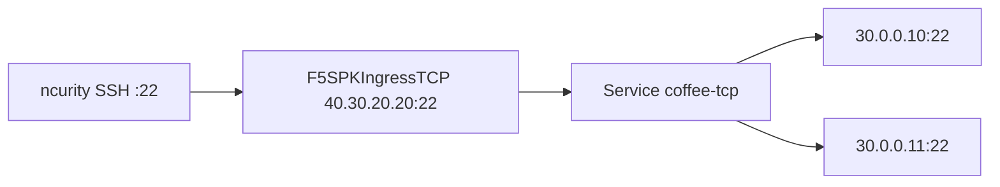

# Test — F5SPKIngressTCP (Service + 외부 Endpoint)

Gateway / L4Route / Pool 이 아님. `F5SPKIngressTCP` 는 **Service 이름**으로 멤버를 찾는다.



## 적용 (마스터)

```bash
kubectl apply -f /root/bnk/web/poc/Test/f5-spk-ingresstcp.yaml
kubectl get intcp -n web
kubectl get svc,ep coffee-tcp -n web
```

## 클라이언트 (ncurity)

```bash
ssh -o StrictHostKeyChecking=no -o ConnectTimeout=5 root@40.30.20.20
```

## 정리

```bash
kubectl delete -f /root/bnk/web/poc/Test/f5-spk-ingresstcp.yaml
```
