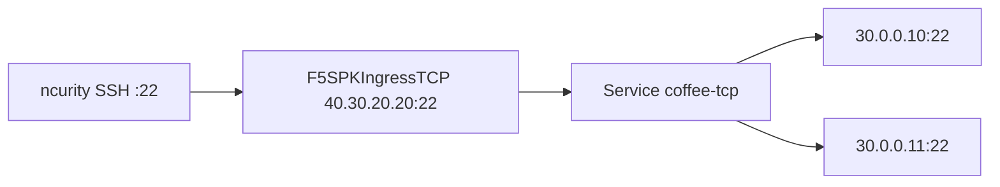

# Test — 추가 기능 검증

Gateway API 2.x/3.x 시트와 **겹치지 않는** 항목. 한 번에 하나만 apply 한다. 같은 VIP를 쓰므로 다음으로 가기 전에 현재 YAML을 지운다.

| 경로 | 내용 |
|---|---|
| [`otel/`](otel/README.md) | OTEL → Prometheus/Grafana. 설치 YAML·대시보드는 이 폴더 |
| [`f5-spk-ingresstcp.yaml`](f5-spk-ingresstcp.yaml) | `F5SPKIngressTCP` (Service + 외부 Endpoint, SSH :22) |
| [`graceful_shutdown_test.yaml`](graceful_shutdown_test.yaml) | Gateway TCP + L4Route graceful shutdown |

---

# F5SPKIngressTCP (Service + 외부 Endpoint)

Gateway / L4Route / Pool 이 아님. `F5SPKIngressTCP` 는 **Service 이름**으로 멤버를 찾는다.



## 적용 (마스터)

```bash
kubectl apply -f /root/bnk/web/poc/Test/f5-spk-ingresstcp.yaml
kubectl get intcp -n web
kubectl get svc,ep coffee-tcp -n web
```

## 클라이언트 (ncurity)

```bash
ssh -o StrictHostKeyChecking=no -o ConnectTimeout=5 root@40.30.20.20
```

## 정리

```bash
kubectl delete -f /root/bnk/web/poc/Test/f5-spk-ingresstcp.yaml
```
