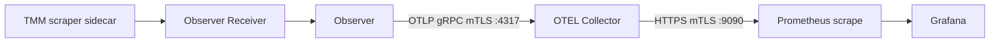

# Test / otel — OTEL 연동

Gateway API 라우팅 시트가 아님. FLO가 올린 **메트릭 파이프**가 Prometheus/Grafana까지 이어지는지 확인한다.

**OTEL Collector / Observer 는 FLO.** Prometheus·Grafana 만 이 폴더 YAML이다 (`monitoring.yaml`). Helm 아님. Collector YAML은 apply 하지 않는다.

```bash
kubectl apply -f /root/bnk/web/poc/Test/otel/monitoring.yaml
kubectl apply -f /root/bnk/web/poc/Test/otel/scrape-per-tmm.yaml
kubectl create configmap grafana-bnk-dashboard -n monitoring \
  --from-file=bnk-poc-ops.json=/root/bnk/web/poc/Test/otel/bnk-poc-ops.json \
  --dry-run=client -o yaml | kubectl apply -f -
kubectl rollout restart deploy/grafana -n monitoring
```



공식: [OTEL Collector](https://clouddocs.f5.com/bigip-next-for-kubernetes/latest/observability/spk-otel-deploy.html), [TODA](https://clouddocs.f5.com/bigip-next-for-kubernetes/latest/observability/spk-stats-aggregation.html), [Grafana](https://clouddocs.f5.com/bigip-next-for-kubernetes/latest/observability/visualize-metrics-in-grafana.html).

## BNK 설정 vs Prometheus 설정

BNK는 Prometheus에 **푸시하지 않는다.** `metricSubsystem` 이 켜지면 FLO가 TMM 통계를 모아 OTEL `:9090` 에 Prometheus 형식으로 **열어 둔다.** Prometheus는 그 주소를 **scrape** 한다.

### BNK 쪽 (제품)

`CNEInstance` `f5-cne-controller` (`f5-bnk-instance`):

```yaml
spec:
  telemetry:
    loggingSubsystem:
      enabled: true    # Fluentd. 메트릭 아님
    metricSubsystem:
      enabled: true    # Observer + OTEL. 이것만 메트릭
```

`true` 이면 FLO가 만든다.

- TMM Pod sidecar `observer` (tmctl scrape)
- `f5-observer-receiver`, `f5-observer` (`f5-cne-core`)
- `OtelCollector` `otel-collector` + Service `otel-collector-svc:4317` / `:9090`

OTEL ConfigMap `f5-otel-collector-conf`:

- **수신** `:4317` OTLP gRPC + mTLS (`/tls/otel/grpc/svr`)
- **노출** `:9090` Prometheus exporter + mTLS (`/external/otelsvr`)
- Prometheus remote_write / URL 필드는 **없음**

`metricSubsystem: false` 이면 OTEL이 없고 scrape 대상이 없다. BNK CR에 Prometheus 주소를 넣는 설정은 없다.

### Prometheus 쪽 (랩, Helm/FLO 아님)

`monitoring` ConfigMap `prometheus-config`. BNK가 아니라 scrape job 이다.

```yaml
scrape_configs:
  - job_name: bnk-otel
    scheme: https
    static_configs:
      - targets:
          - otel-collector-svc.f5-cne-core.svc.cluster.local:9090
    tls_config:
      cert_file: /etc/prometheus/certs/tls.crt
      key_file: /etc/prometheus/certs/tls.key
      ca_file: /etc/prometheus/certs/ca.crt
      insecure_skip_verify: true
```

인증서: `Certificate/prometheus-client` → Secret `prometheus-client-secret`, issuer `f5-bnk-ca-cluster-issuer` (BNK와 같은 CA). `:9090` 이 client cert를 요구하므로 HTTP로 찌르면 TLS handshake 실패한다.

정리: BNK는 메트릭을 **항상 모으고** (subsystem on), Prometheus는 **HTTPS+클라이언트 인증서로 scrape** 하면 된다. BNK에 Prometheus를 등록할 필요는 없다.

## 선행

- `metricSubsystem.enabled: true`
- OTEL `:9090` 은 HTTPS. Prometheus가 `prometheus-client-secret` 으로 scrape
- 트래픽은 이 폴더 Gateway가 아니라 [`HTTP_Routing/2.1_HTTProute`](../../HTTP_Routing/2.1_HTTProute/)
- VIP curl 은 ncurity. Prometheus 조회는 마스터

## 1. 파이프 확인 (마스터)

```bash
kubectl get cneinstance -n f5-bnk-instance f5-cne-controller \
  -o jsonpath='metrics={.spec.telemetry.metricSubsystem.enabled}{"\n"}logging={.spec.telemetry.loggingSubsystem.enabled}{"\n"}'

kubectl get otelcollector,observer -n f5-cne-core
kubectl get pods -n f5-cne-core | grep -E 'otel|observer'
kubectl get svc otel-collector-svc -n f5-cne-core
```

**기대 응답**
- `metrics=true`
- `OtelCollector` `otel-collector` Available
- Pod `otel-collector-*`, `f5-observer-0`, `f5-observer-receiver-0` Running
- Service `4317/TCP` (OTLP), `9090/TCP` (Prometheus exporter)

## 2. Prometheus scrape

NodePort `31929` (어느 노드 IP나 됨). 이 랩 master는 `192.168.47.240`.

```bash
curl -sS 'http://192.168.47.240:31929/api/v1/query?query=up%7Bjob%3D%22bnk-otel%22%7D'
```

또는

```bash
kubectl exec -n monitoring deploy/prometheus -- \
  wget -qO- 'http://localhost:9090/api/v1/query?query=up{job="bnk-otel"}'
```

**기대 응답**
- `up{job="bnk-otel"}` = `1`
- instance `otel-collector-svc.f5-cne-core.svc.cluster.local:9090`

메트릭이 들어오는지:

```bash
curl -sS 'http://192.168.47.240:31929/api/v1/label/__name__/values' | grep -c f5_
```

**기대 응답**
- `f5_` 접두 메트릭이 수백 개. 예: `f5_tmm_clientside_received_packets_total`, `f5_pool_member_serverside_connections_count_total`

## 3. 트래픽 후 coffee 멤버 카운터

같은 VIP에 다른 Gateway가 있으면 먼저 지운다.

```bash
kubectl apply -f /root/bnk/web/poc/HTTP_Routing/2.1_HTTProute/gw-http-route.yaml
```

ncurity:

```bash
for i in $(seq 1 20); do
  curl -sS --resolve coffee.f5bnk.com:80:40.30.20.20 http://coffee.f5bnk.com/login
  echo
done
```

**기대 응답**
- Body: `COFFEE SERVER - 30.0.0.10`

마스터, scrape 한 주기(15s) 뒤:

```bash
curl -sS --get 'http://192.168.47.240:31929/api/v1/query' \
  --data-urlencode 'query=f5_pool_member_serverside_connections_count_total{f5_pool_member_ip_address="30.0.0.10"}'
```

**기대 응답**
- series 존재, `f5_pool_member_port="80"`
- 트래픽 전보다 `connections_count_total` 증가

없으면 TMM debug 로 대조 (OTEL 이 아니라 dataplane):

```bash
TMM=$(kubectl get pod -n f5-bnk-instance -l app=f5-tmm -o jsonpath='{.items[0].metadata.name}')
kubectl exec -n f5-bnk-instance "$TMM" -c debug -- \
  tmctl -d blade pool_member_stat -s pool_name,addr,port,serverside.tot_conns
```

## 4. Grafana

```text
http://192.168.47.240:32000
http://192.168.47.240:32000/d/bnk-poc-ops/bnk-poc-ops
```

계정: `admin` / `ncurity1@#` (Secret `grafana-admin`, `monitoring.yaml`).

보드 **BNK PoC / Ops** (`bnk-poc-ops.json`). 상단 **TMM pod** 드롭다운에서 **하나만** 고른다. 아래 그래프가 그 Pod로 바뀐다.

FLO default scrape 의 VS/pool/TCP 는 **Aggregated = 두 TMM 합**. 평균이 아니다. Grafana가 한 번 더 합친 것도 그 합 위였다. Pod별 보기는 `scrape-per-tmm.yaml` (Diagnostic) 로 `target_name` 이 생긴 시계열만 쓴다. 클러스터 전체 트래픽은 두 Pod 페이지를 **더하면** 된다.

### 대시보드에서 확인

| 행 | 패널 | 집계 |
|---|---|---|
| 상단 | scrape, TMM pod 수, VS series (cluster sum) | 클러스터 |
| `$pod` | CPU thread 0/32, mem, conn, throughput, drop, VS, PoC pool, TCP/RST | **선택한 TMM만** (합·평균 아님. CPU만 thread별 %) |

VS/PoC pool 은 Gateway(`2.1`) 후. CPU 축 0–10% (유휴 ~1%).

### CPU 0 과 32

**Pod 하나가 core 0, 다른 Pod가 core 32가 아니다.** 각 TMM 프로세스 하나(`tmm.0 --cpu 0,32`)가 **그 노드의 CPU 0 과 32** 에 핀된다. worker 는 64 core 이라 0 과 32 는 보통 NUMA 노드당 첫 코어. 같은 pid, memory 는 cpu 0 쪽에만 잡힌다. `f5-tmm` 컨테이너 request/limit 은 **1 CPU**.

### HTTP / SSL / gRPC / method / URI / TLS version

**OTEL에 없다.** [카탈로그](https://clouddocs.f5.com/bigip-next-for-kubernetes/latest/observability/spk-otel-stats.html) 에 profile_http / clientssl / URI / method / TLS version 테이블이 없고 default scrape 에도 없다. 있는 TCP 는 `profile_tcp_stat` (open/accepts/rtt 등) 뿐. Prometheus 의 `f5_grpc_*` 는 Observer 컨트롤플레인이지 GRPCRoute 트래픽이 아니다.

멤버 health(up/down)·HTTPRoute path→pool 도 메트릭 없음 (`OPS-CHECKLIST` §2).

### PoC 시트

| 시트 | 대시보드 | 대시보드에 없으면 |
|---|---|---|
| 2.1 HTTPRoute | VS, PoC pool `30.0.0.10` | — |
| 2.x path/header/weight/redirect | 없음 | curl body/status |
| 3.10–3.15 GRPCRoute | TMM conn (앱 gRPC 카운터 없음) | ncurity `grpcurl` |
| 3.x TLS terminate / BackendTLS | 없음 | `tmctl profile_clientssl_stat` / `profile_serverssl_stat` |
| iRule 시트 | 없음 | `tmctl -d blade rule_stat` |

```bash
TMM=$(kubectl get pod -n f5-bnk-instance -l app=f5-tmm -o jsonpath='{.items[0].metadata.name}')
kubectl exec -n f5-bnk-instance "$TMM" -c debug -- tmctl -d blade virtual_server_stat -s name,clientside.cur_conns,clientside.tot_conns
kubectl exec -n f5-bnk-instance "$TMM" -c debug -- tmctl -d blade pool_member_stat -s pool_name,addr,port,serverside.tot_conns
kubectl exec -n f5-bnk-instance "$TMM" -c debug -- tmctl -d blade rule_stat
kubectl exec -n f5-bnk-instance "$TMM" -c debug -- tmctl -d blade profile_http_stat
kubectl exec -n f5-bnk-instance "$TMM" -c debug -- tmctl -d blade profile_clientssl_stat
kubectl exec -n f5-bnk-instance "$TMM" -c debug -- tmctl -d blade profile_serverssl_stat
```

## 정리

OTEL/Prometheus/Grafana 는 지우지 않는다. 트래픽용 2.1 만 지운다.

```bash
kubectl delete -f /root/bnk/web/poc/HTTP_Routing/2.1_HTTProute/gw-http-route.yaml
```

## 이번 랩 (2026-09-13)

파이프 확인까지는 통과. 2.1 트래픽 카운터는 apply 후 ncurity에서 재확인.

| 항목 | 값 |
|---|---|
| CNEInstance | `metrics=true`, `logging=true` |
| OTEL | `otel-collector` (`f5-cne-core`), image `opentelemetry-collector-contrib:0.155.0` |
| Observer | `f5-observer-0` / `f5-observer-receiver-0` Running |
| Prometheus | `monitoring`, job `bnk-otel`, `up=1`, NodePort `31929` |
| Grafana | `monitoring`, NodePort `32000`, 보드 `bnk-poc-ops` |
| 설치 YAML | `monitoring.yaml`, `scrape-per-tmm.yaml` |
| series | VS/PoC pool Grafana 는 Diagnostic(Pod별). HTTP method/URI/TLS version 은 없음, `tmctl` |
