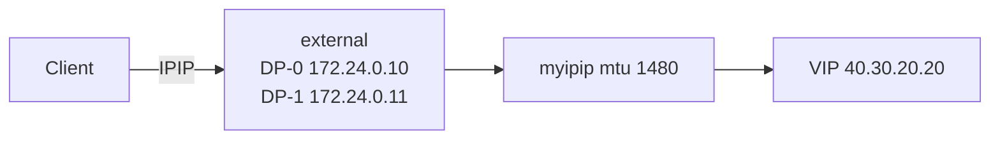

# Config IPIP Tunnel Guide

TMM IPIP tunnel 설정. 수정하는 것은 **ConfigMap** 과 **DaemonSet 이미지** 두 개입니다.

초기 파드 기동 때 `user_conf.tcl` 이 `tmm_device_name` 보다 먼저 평가되면 `switch` 가 매칭되지 않아 `myipip` 가 안 만들어질 수 있습니다. 이미지 롤아웃이 끝난 뒤, ConfigMap의 출력문 한 줄만 바꿔 **재로딩을 한 번 더** 유도해야 합니다. IP·MTU·터널 본문은 그대로 둡니다. 추가 재시작은 하지 않습니다.

## 구성



| 항목 | 값 |
|---|---|
| Namespace | `f5-bnk-instance` |
| ConfigMap | `tmm-init` → `data.user_conf.tcl` |
| DaemonSet | `f5-tmm` → container `f5-tmm` image |
| Tunnel | `myipip` |
| DP-0 | `local_ip 172.24.0.10` |
| DP-1 | `local_ip 172.24.0.11` |
| MTU | `1480` |
| 이미지 | `repo.f5.com/images/tmm-img:v10.203.3` |

`tmm_init.tcl` 은 수정하지 않습니다. tunnel 설정은 `user_conf.tcl` 에만 넣습니다.

워커 노드의 외부 NIC `enp94s0f0np0` 는 netplan `/etc/netplan/60-sf-external.yaml` 로 부팅 시 UP 됩니다. IP는 넣지 않습니다. TMM Self IP가 그 주소를 가집니다.

---

## 왜 외부 Self IP ping이 안 됐는가

각 워커에는 랜선이 **두 줄** 있습니다.

| 노드 포트 | 역할 | TMM Pod 이름 |
|---|---|---|
| `eno1np0` | 내부망 (쿠버네티스 192.168.47.x) | `net2` (NAD `sf-internal`) |
| `enp94s0f0np0` | 외부망 (클라이언트/IPIP 172.24.0.x) | `net1` (NAD `sf-external`) |

TMM은 켜져 있는 포트만 번호로 셉니다. 원래 기대는 `1.1 = net1(외부)`, `1.2 = net2(내부)` 입니다.

재부팅 후 `enp94s0f0np0` 가 netplan에 없어서 **꺼진 채**로 남았습니다. Pod의 `net1` 도 NO-CARRIER가 됩니다. 그때 TMM은 죽은 `net1`을 건너뛰고 `1.1 = net2(내부)` 만 만듭니다.

VLAN CR `sf-external` 은 `interfaces: ["1.1"]` 이라 Self IP 172.24.0.10/11 이 **이름만 외부, 실제로는 내부 포트**에 붙습니다.

그래서:

- 클라이언트(진짜 외부망) → `.10`/`.11` ping **실패** (TMM이 그 포트에 없음)
- TMM끼리 `.10`↔`.11` 은 **성공** (둘 다 내부망에 있음)
- VIP ping 성공만으로 외부 Self IP가 정상이라고 보면 **안 됨**

고치려면 외부 NIC를 UP 한 뒤 TMM을 재기동해야 `1.1` 이 다시 `net1`에 붙습니다. NIC만 UP 해서는 TMM이 번호를 다시 매기지 않습니다.

---

## 적용

### 1. ConfigMap — `user_conf.tcl`

```bash
kubectl get cm tmm-init -n f5-bnk-instance -o yaml
```

`data.user_conf.tcl` 을 아래 내용으로 맞춥니다. 맨 아래 `puts` 한 줄은 이후 재로딩용 마커입니다.

```tcl
puts "tmm_device_name = [tmm_device_name]"
bigdb connection.autolasthop disable
switch [tmm_device_name] {
  "DP-0" {
    puts "this is DP-0"
    ipip_tunnel "myipip" {
      mtu 1480
      local_ip 172.24.0.10
    }
  }
  "DP-1" {
    puts "this is DP-1"
    ipip_tunnel "myipip" {
      mtu 1480
      local_ip 172.24.0.11
    }
  }
}
puts "user_conf reload test"
```

한 줄 patch:

```bash
kubectl patch cm tmm-init -n f5-bnk-instance --type merge -p '{"data":{"user_conf.tcl":"puts \"tmm_device_name = [tmm_device_name]\"\nbigdb connection.autolasthop disable\nswitch [tmm_device_name] {\n  \"DP-0\" {\n    puts \"this is DP-0\"\n    ipip_tunnel \"myipip\" {\n      mtu 1480\n      local_ip 172.24.0.10\n    }\n  }\n  \"DP-1\" {\n    puts \"this is DP-1\"\n    ipip_tunnel \"myipip\" {\n      mtu 1480\n      local_ip 172.24.0.11\n    }\n  }\n}\nputs \"user_conf reload test\"\n"}}'
```

또는 `kubectl edit cm tmm-init -n f5-bnk-instance` 로 같은 내용을 넣습니다.

### 2. DaemonSet — TMM 이미지

```bash
kubectl edit daemonset f5-tmm -n f5-bnk-instance
```

container `f5-tmm` 의 image 를 바꿉니다.

```yaml
image: repo.f5.com/images/tmm-img:v10.203.3
```

`postStart` 는 이미 있으면 그대로 둡니다. 추가하지 않습니다.

```yaml
lifecycle:
  postStart:
    exec:
      command:
      - /opt/bin/core_helper_init.sh
```

이미지 변경 후 TMM 파드가 재시작됩니다. 교체가 끝날 때까지 기다립니다.

```bash
kubectl rollout status ds/f5-tmm -n f5-bnk-instance --timeout=300s
kubectl get pods -n f5-bnk-instance -l app=f5-tmm -o wide
kubectl get ds f5-tmm -n f5-bnk-instance -o jsonpath='{.spec.template.spec.containers[?(@.name=="f5-tmm")].image}{"\n"}'
```

시간 초과면 다음 단계로 넘어가기 전에 Pod 상태를 확인합니다.

### 3. 롤아웃 후 ConfigMap 재로딩

이 시점에 `tmm_device_name` 은 이미 `DP-0` / `DP-1` 이어야 합니다. IP·MTU·터널 설정은 건드리지 않고, **맨 아래 `puts` 문구만** 바꿔 ConfigMap 재로딩을 유도합니다. 파드를 다시 재시작하지 않습니다.

```bash
kubectl edit cm tmm-init -n f5-bnk-instance
```

`data.user_conf.tcl` 맨 아래의 기존 문구:

```tcl
puts "user_conf reload test"
```

를 날짜가 들어간 새 문구로 바꾸고 저장합니다. 문자열은 이전과만 다르면 됩니다.

```tcl
puts "IPIP reload after rollout 20260907"
```

이 변경은 **DP 이름이 할당된 현재 시점에 기존 터널 생성 코드를 다시 실행시키기 위한 것**입니다.

이후 롤아웃을 다시 하게 되면, 같은 방식으로 `puts` 문자열만 또 바꿉니다. 터널 `local_ip` / `mtu` 는 유지합니다.

---

## 검증

파드 이름은 `kubectl get pods` 결과로 바꿉니다. 롤아웃 직후라면 아래 루프로 전 파드를 한 번에 확인합니다.

```bash
for pod in $(kubectl get pod -n f5-bnk-instance \
  -l app=f5-tmm -o jsonpath='{.items[*].metadata.name}'); do
  echo "=== $pod ==="

  kubectl exec -n f5-bnk-instance "$pod" -c f5-tmm -- \
    tail -n 2 /opt/lib/tmm/user_conf.tcl

  kubectl logs -n f5-bnk-instance "$pod" -c f5-tmm --since=5m \
    | grep -E 'Reloading file|tmm_device_name|this is DP|IPIP'

  kubectl exec -n f5-bnk-instance "$pod" -c debug -- \
    ip -d link show myipip
done
```

새 `puts` 문구가 아직 `/opt/lib/tmm/user_conf.tcl` 에 없으면 ConfigMap 반영을 기다린 뒤 다시 확인합니다. **`tmm_device_name = DP-0/DP-1` 과 `myipip` 생성이 확인돼야** 적용된 것입니다.

### 1. TMM 로그 (단일 파드)

```bash
kubectl logs -n f5-bnk-instance f5-tmm-6h6gx -c f5-tmm | grep -E 'this is DP|IPIP tunnel'
```

기대:

```text
this is DP-0
IPIP tunnel myipip is created
```

다른 파드는 `this is DP-1`.

### 2. debug 에서 인터페이스

```bash
kubectl exec -n f5-bnk-instance f5-tmm-6h6gx -c debug -- ip -br a
```

기대: `myipip` 가 목록에 있음. IPv4가 없고 `fe80::` 만 있어도 됩니다.

```text
external         UNKNOWN        172.24.0.10/24 ...
myipip           UNKNOWN        fe80::.../64
```

두 파드 모두 `myipip` 가 보여야 합니다.

### 3. 클라이언트

```bash
curl --resolve coffee.f5bnk.com:80:40.30.20.20 http://coffee.f5bnk.com/
```
